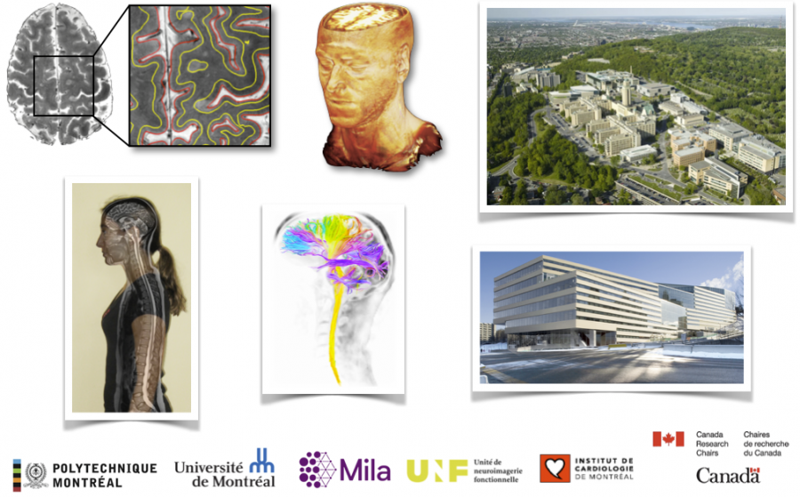

# Welcome to NeuroPoly

```{toctree}
:hidden:
self
team/index
facilities
research/index
publications
software
events-and-workshops
job-opportunities/index
contact-us
```

**NeuroPoly** is a research laboratory specialized in neuroimaging. It is based at [Polytechnique Montreal](http://www.polymtl.ca/) on the [Université de Montréal](http://www.umontreal.ca/) campus, in Montreal, Canada.

[](https://twitter.com/polyneuro)



