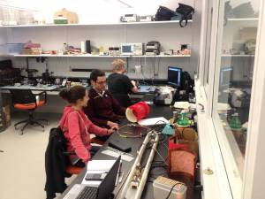

# 🏛  Facilities

The main lab is located at Ecole Polytechnique, 5th floor, biomedical engineering section \(L5613, L5626\).

## Computer Lab

 

### **NeuroPoly Computing Equipment**

* ~ 15 iMac workstations \(quad-core up to 3.4GHz, at least 16GB RAM\)
* 1 data storage station \(max 15TB\) which is backed up nightly on another station \(physically located elsewhere\)
* 2 CPU clusters \(64-core & 12-core Xeon Phi\)
* 3 GPU clusters \(8xP100 & 2xTesla\). 

### Additional Computing Equipment

In addition, the lab has free access to:

* 2 CPU clusters located at the Geriatric Institute Research Center of the Université de Montréal \(64-core & 24-core\)
* CPU/GPU/Storage resources from Compute Canada \([https://www.computecanada.ca/research-portal/accessing-resources/available-resources/](https://www.computecanada.ca/research-portal/accessing-resources/available-resources/)\).

### Software

In terms of software license, being part of Polygrames Research Center and École Polytechique, NeuroPoly has access to multiple software for engineering, mathematical computing and simulations \([http://www.grames.polymtl.ca/facilities/servers-information/](http://www.grames.polymtl.ca/facilities/servers-information/)\).

## RF Lab

 

NeuroPoly has expertise in building radiofrequency \(RF\) coils for MRI applications. This RF lab is part of [TransMedTech's technology platform](https://www.polymtl.ca/transmedtech/en/research-development/technology-platforms/imaging-technologies/design-and-manufacture-mri-antennas). The infrastructure includes:

* Three network analyzers
  * E5061B \(100kHz-3GHz, full two-port S-parameters\)
  * E5061A \(300kHz-1.5GHz, two-port\)
  * FieldFox N9923A \(portable, shielded, full two-port S-parameters\)
* Four DC sources
* Several multimeters, small capacitance meter, inductor meter, current probe
* Set of non-magnetic fixed and variable capacitors.
* PCB printing facilities \(acid-based or routing machine\)
* 3D printing:
  * [Builder Premium Large Red \(dual-feed build. Print volume: 205 x 215 x 600 mm\)](https://www.go-3dprint.com/products/builder-3d-printer-premium-large-red.html)
  * [Modix BIG-60 V3. Print volume: 600 X 600 X 660 mm](https://www.modix3d.com/big60-order/)
* License to ADS + CST
* Part of [Poly-Grames](http://www.grames.polymtl.ca/) and [CREER](http://www.creer.polymtl.ca/index_en.htm).

## MRI Facilities

### 3T Human

**List of available scanners:**

* [3T Prisma \(Siemens\)](https://www.siemens-healthineers.com/magnetic-resonance-imaging/3t-mri-scanner/magnetom-prisma) located at the [Unité de Neuroimagerie Fonctionnelle](http://www.unf-montreal.ca/).
  * [Path to "Unité de Neuroimagerie Fonctionnelle"](https://www.neuro.polymtl.ca/_media/path_to_unf.pdf)
* [3T Skyra \(Siemens\)](https://www.siemens-healthineers.com/magnetic-resonance-imaging/3t-mri-scanner/magnetom-skyra) located at Polytechnique Montreal \(JAB building\).
* 3T Skyra \(Siemens\) located at [Montreal Heart Institute](https://www.icm-mhi.org/).

**Features:**

* Video projection system for functional MRI experiments.
* Physiological monitoring systems \(Biopac\).
* Non-commercial pulse sequences \(for advanced diffusion, 2D-RF excitation, dynamic shimming, etc.\).
* Unique 24-channel shimming system for the spinal cord MRI
* Air compressor

### 7T Human

**List of available scanners:**

* [7T Terra \(Siemens\)](https://www.siemens-healthineers.com/magnetic-resonance-imaging/7t-mri-scanner/magnetom-terra) located at the [McConnell Brain Imaging Centre](https://www.mcgill.ca/bic/).

**Features:**

* Custom RF coil for research purposes  8 pTx & 20 Rx

### 7T Animal - Small Bore

* Varian/Agilent 7T MR system located at the [Montreal Heart Institute](http://www.icm-mhi.org/).
* Gradients
  * 305/210 HD, Internal Diameter: 210 mm, 300 mT/m, 470 mT/m/ms
  * 205/120 HD, Internal Diameter: 120 mm, 600 mT/m, 4400 mT/m/ms
* Animal facilities \(rats, mice, rabbits\).
* Commercial and custom-made coils available.
  * 4ch Rx-only mouse coil \(RapidMR\), 32mm diameter.
* Access to histology for ex vivo scans.
* [Wiki for coil dev / pulse seq programming / MR acquisition \(login required\)](http://liom2.polymtl.ca/internal/systems_and_their_operation/mri)

