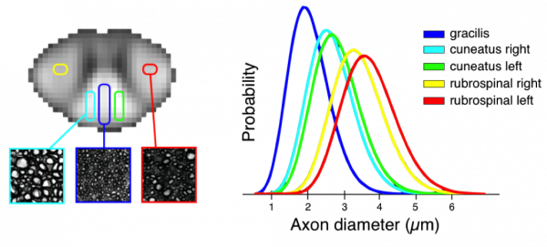
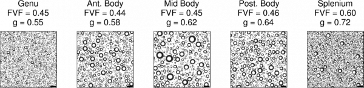

# Biophysical Modelling

Realistic tissue model for simulating the q-space diffusion MR signal. The tissue model shown on the left was based on real histological data and represents five different fibre calibre distributions for five different regions of the human corpus callosum. Shown is a simulation for one region \(zoomed cube including fibres\). The simulation software enables us to choose a distribution of axon diameter, density, orientation and myelin thickness. Here we set realistic values from histology. The right panel shows a simulated MR signal given a set of q-space acquisition parameters, e.g., the diffusion time \(Δ\) and the maximum gradient strength \(Gmax\).

Above is an example of the application of biophysical models to characterizing white microstructure: the first mapping of axon diameter distributions in the human spinal cord in vivo. The scanning was performed using the 300 mT/m Connectome gradient system

> Duval T, McNab JA, Setsompop K, Witzel T, Schneider T, Huang SY, Keil B, Klawiter EC, Wald LL, and Cohen-Adad J, In vivo estimation of axon diameter in the human spinal cord using 300 mT/m gradients. Proceedings of the 22th Annual Meeting of ISMRM, Milan, Italy, 2014: p. 5005.

Adding a myelin metric to the above data, and assuming the white matter model described [here](in-vivo-measurement-of-myelin-g-ratio.md), it is possible to generate images with information on a scale that is orders of magnitude smaller than the native MR resolution. We call the images above 'simulated electron micrographs'.

> Stikov N, Perry LM, Ryklevskaya E, Mezer A, Wandell BA, Pauly JM, Dougherty RF. Bound Pool Fractions Complement Diffusion Measures in Characterizing White Matter Micro and Macrostructure. Neuroimage 2011; 54\(2\): 1112-1121.

