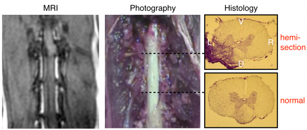
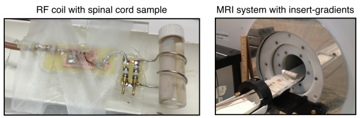
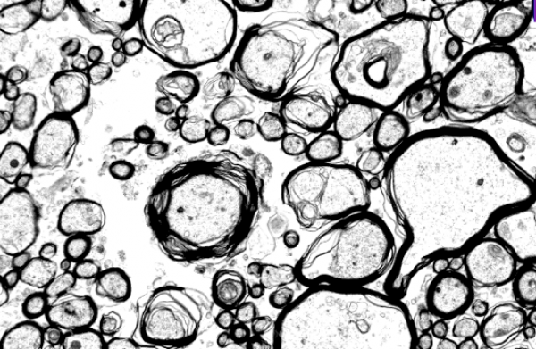

# Ex Vivo Imaging of Spinal Cord Injury

## Validation Using Histology

Model of spinal cord injury. The left panel shows the MRI performed in vivo after the injury. The middle and right panel respectively show the injury during dissection and after histology. The top histology slice shows that the injury spans the dorsal left segment, affecting both the dorsal column \(sensory\) and the corticospinal tract \(ascending\). The bottom histology slice shows uninjured tissue. V=Ventral, D=Dorsal, L=Left, R=Right

Custom-made transmit-receive solenoid coil with the cat spinal cord sample and the installation on the 7T MR system equipped with 600 mT/m insert gradients \(Varian/Agilent\)

Quantitative magnetization transfer and q-space diffusion imaging to quantity axon features \(density, diameter, myelination\)

Electron microscopy imaging of axons to validate MRI measures.

