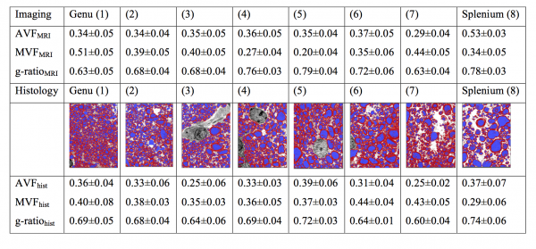
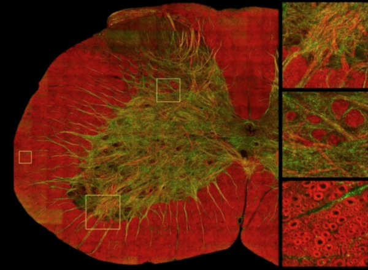

# Histological Validation of Quantitative MRI

The table above shows mean values \(± standard deviation\) of the axon volume fraction \(AVF\), myelin volume fraction \(MVF\), and g-ratio in a mid-sagittal slice of the corpus callosum \(CC\) of a cynomolgus macaque. The values in the top half of the table are obtained from MRI and the electron microscopy \(EM\) validation is on the bottom. In the middle of the table are segmented EM images \(myelin in red and axon in blue\) taken from each of the eight CC segments.

> Stikov N\*, Campbell JSW\*, Stroh T, Lavelée M, Frey S, Novek J, Nuara S, Ho M, Bedell BJ, Dougherty RF, Leppert IR, Boudreau M, Narayanan S, Picard P, Duval T, Cohen-Adad J, Gasecka A, Côté D, Pike GB. In vivo histology of the myelin g-ratio with magnetic resonance imaging. Neuroimage 2015; \(in press\) \*_These authors contributed equally to this work_

The biggest challenge for the experiment above was the small spatial coverage provided by the EM. To provide histological coverage that matches the scale of the MR images, we have recently imaged brain tissue using Coherent Anti-Stokes Raman Scattering \(CARS\). Image courtesy of Daniel Côté.

