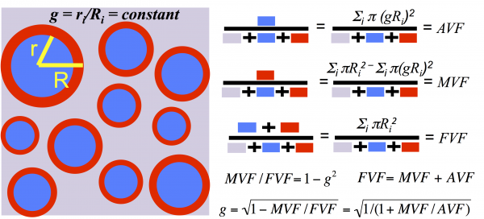
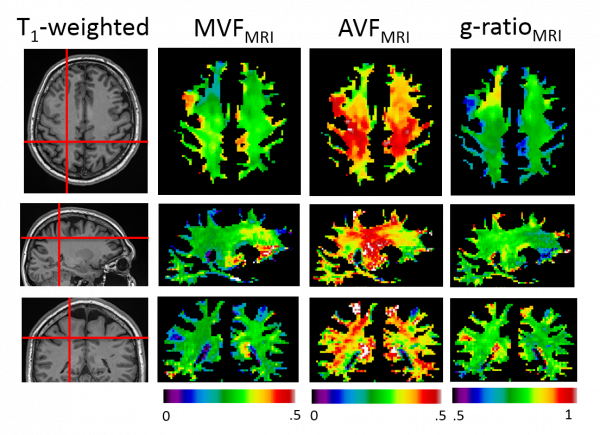

# In Vivo Measurement of Myelin G-Ratio

The myelin g-ratio \(defined as the ratio of the inner to the outer diameter of the myelin sheath\) is a fundamental microstructural property of white matter that enables fast conduction of information. Variations in the g-ratio have been reported in histological studies of brain development and disease, but measuring it non-invasively in a living human being is a major challenge. Above is a white matter model that helps us define and compute the myelin g-ratio. This model allows us to extract microstructural information on a scale much smaller than the native MRI resolution. It assumes uniformity across the voxel of interest \(much like the rest of quantitative MRI\), and defines aggregate measures of the axon volume fraction, myelin volume fraction, fiber volume fraction, and the g-ratio.

Using quantitative magnetization transfer \(qMT\) as a biomarker for MVF, and neurite orientation dispersion and density imaging \(NODDI\) as a biomarker for AVF, we can compute whole-brain maps of the AVF, MVF and the myelin g-ratio. For applications of this technique to the study of multiple sclerosis, please click [here](white-matter-microstructure-in-multiple-sclerosis.md).

> Stikov N\*, Campbell JSW\*, Stroh T, Lavelée M, Frey S, Novek J, Nuara S, Ho M, Bedell BJ, Dougherty RF, Leppert IR, Boudreau M, Narayanan S, Picard P, Duval T, Cohen-Adad J, Gasecka A, Côté D, Pike GB. In vivo histology of the myelin g-ratio with magnetic resonance imaging. Neuroimage 2015; \(in press\) \*These authors contributed equally to this work

