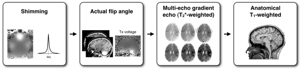
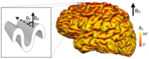

# Mapping Myeloarchitecture using T2\* and Magnetization Transfer

## Data Acquisition

7T MRI at the [Harvard Martinos Center for Biomedical Imaging](https://www.martinos.org/) \(Boston\)

Example of data:

## Data Processing

Correct artifacts and process T2\*:

Use FreeSurfer to reconstruct the surface:

Map T2\* values into the cortex of each individual and register to human surface template:

## Use Multimodal Information to Study Neuronal Architecture

Reproducibility of T2\* mapping and distribution across Brodmann areas:

Multimodal mapping:

## Study the Effect of Tissue Orientation With Respect to B0

Map the orientation of the cortical surface with respect to B0:

Results show an orientation dependence only in regions with high degree of myelination!

## References

* Cohen-Adad J. _What can we learn from T2\* maps of the cortex?_ **Neuroimage** 2013. [http://dx.doi.org/10.1016/](http://dx.doi.org/10.1016/) j.neuroimage.2013.01.023
* Cohen-Adad J, Polimeni JR, Helmer KG, Benner T, McNab JA, Wald LL, Rosen B, Mainero C. T2\* mapping and B0 orientation-dependence at 7T reveal cyto- and myeloarchitecture organization of the human cortex. **Neuroimage** 2012;DOI: 10.1016/j.neuroimage.2012.01.053. [PDF](https://dl.dropbox.com/u/20592661/publications/Cohen-Adad_2012_T2starB0dependence.pdf)

