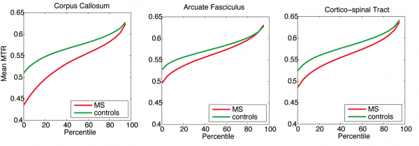

# White Matter Microstructure in Multiple Sclerosis

By combining myelin and diffusion imaging, we can perform magnetic resonance tractometry and detect the level of myelination along white matter fibers. Above is an illustration of the fibers with the highest bound pool fraction \(myelin surrogate\) in five healthy volunteers.

> Stikov N, Perry LM, Ryklevskaya E, Mezer A, Wandell BA, Pauly JM, Dougherty RF. Bound Pool Fractions Complement Diffusion Measures in Characterizing White Matter Micro and Macrostructure. Neuroimage 2011; 54\(2\): 1112-1121

Above is a tractometry analysis in a cohort of MS patients, compared against healthy controls. On average, MS patients have lower magnetization transfer ratio \(myelin surrogate\) along tracts, which is consistent with lower myelin content in normal appearing white matter. However, the high MTR fibers \(90th percentile and above\) seem to be comparable in MS patients and in controls, suggesting that some normal appearing white matter may, in fact, be healthy.

> Stikov N, Giorgio A, Campbell JSQ, Mazerolle E, Narayanan S, De Stefano N, Pike GB. A Region of Interest Approach to Multiple Sclerosis Tractometry. In: Proceedings of the ISMRM White Matter Study Group Workshop on Multiple Sclerosis as a Whole-brain Disease, London 201

In addition to tractometry analysis, combining diffusion and myelin imaging allows a voxelwise computation of the aggregate g-ratio, a measure of the relative myelin thickness. Above is an image showing lower fiber and myelin content in MS lesions \(arrows\), but the g-ratio is elevated only in the most recent lesion.

> Stikov N\*, Campbell JSW\*, Stroh T, Lavelée M, Frey S, Novek J, Nuara S, Ho M, Bedell BJ, Dougherty RF, Leppert IR, Boudreau M, Narayanan S, Picard P, Duval T, Cohen-Adad J, Gasecka A, Côté D, Pike GB. In vivo histology of the myelin g-ratio with magnetic resonance imaging. Neuroimage 2015; \(in press\) \*These authors contributed equally to this work

