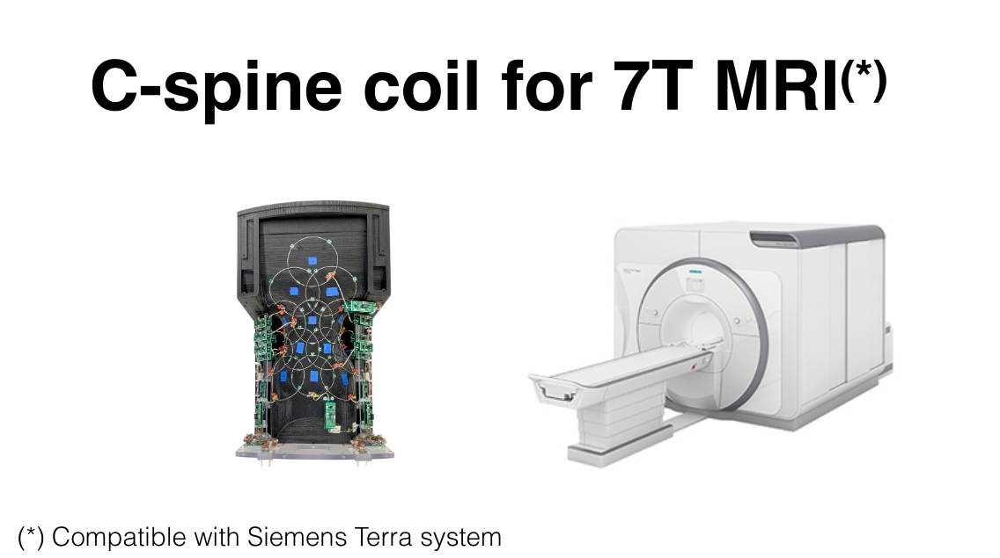

# RF & Shim Coil Design

The RF Lab is supported by [TransMedTech](https://www.polymtl.ca/transmedtech/en/research-development/technology-platforms/imaging-technologies/design-and-manufacture-mri-antennas).

## RF Coils for MRI

<iframe src="https://docs.google.com/presentation/d/1BuAzzgm-FULRf6z83uCowXtB2wfiBxgnK-ODXE04RRM/embed?start=true&loop=false&delayms=60000" frameborder="0" width="710" height="436" allowfullscreen="true" mozallowfullscreen="true" webkitallowfullscreen="true"></iframe>

## C-Spine Coil for 7T MRI

  

    <object data="../_media/201907187tspinecoil.pdf" type="application/pdf" />
      <!-- fallback -->
      
    </object>
  

## Real-time shimming

  

    <object data="../_media/acdc3t.pdf" type="application/pdf" />
      <!-- fallback -->
      
    </object>
  

