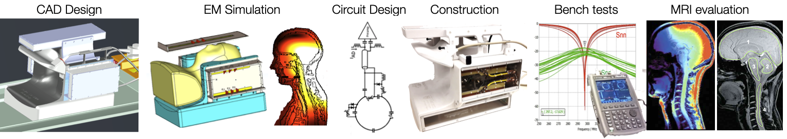

# RF & Shim Coil Design

```{Important}
**Open position for PhD and Postdoc!** More details at: [https://www.ismrm.org/jobs/j08466.pdf](https://www.ismrm.org/jobs/j08466.pdf)
```



## Hardware

### RF Coils for MRI

<iframe src="https://docs.google.com/presentation/d/1BuAzzgm-FULRf6z83uCowXtB2wfiBxgnK-ODXE04RRM/embed?start=true&loop=false&delayms=60000" frameborder="0" width="710" height="436" allowfullscreen="true" mozallowfullscreen="true" webkitallowfullscreen="true"></iframe>

### C-Spine Coil for 7T MRI

<iframe src="https://docs.google.com/presentation/d/12kbI2_nI0VYLRx5c6uzryIufFFK-OneRBaub88VCBmQ/embed?start=true&loop=false&delayms=60000" frameborder="0" width="710" height="436" allowfullscreen="true" mozallowfullscreen="true" webkitallowfullscreen="true"></iframe>

## Software

### RF Shimming

**"Shimming-Toolbox: an open-source software package for performing realtime B0 shimming experiments"** by Alexandre D'Astous et al. *Prepared for the 2021 ISMRM & SMRT Virtual Conference & Exhibition [https://www.ismrm.org/21m/](https://www.ismrm.org/21m/).*
<iframe width="560" height="315" src="https://www.youtube.com/embed/jEe1XUZnUQ4?si=tp2wPxFKnqy8sNGf" title="YouTube video player" frameborder="0" allow="accelerometer; autoplay; clipboard-write; encrypted-media; gyroscope; picture-in-picture; web-share" allowfullscreen></iframe>
<p></p>

**"RF shimming in the spinal cord at 7T"** by Daniel Papp et al. *Prepared for the 2023 ISMRM & SMRT Virtual Conference & Exhibition in Toronto [https://www.ismrm.org/23m/](https://www.ismrm.org/23m/).*
<iframe width="560" height="315" src="https://www.youtube.com/embed/Mv5n4ai_O2o?si=qmJsLCtxRSMmmxFZ" title="YouTube video player" frameborder="0" allow="accelerometer; autoplay; clipboard-write; encrypted-media; gyroscope; picture-in-picture; web-share" allowfullscreen></iframe>
<p></p>

**"Slice-wise z-shimming for spinal cord fMRI with Shimming Toolbox"** by Alexandre D’Astous et al. *Prepared for the 2023 ISMRM & SMRT Virtual Conference & Exhibition in Toronto [https://www.ismrm.org/23m/](https://www.ismrm.org/23m/).*
<iframe width="560" height="315" src="https://www.youtube.com/embed/JTxRWRivP24?si=rxFZ-lpci0LJ0iVz" title="YouTube video player" frameborder="0" allow="accelerometer; autoplay; clipboard-write; encrypted-media; gyroscope; picture-in-picture; web-share" allowfullscreen></iframe>
<p></p>

### RF Pulse Design

**"Universal Pulses for the cervical spinal cord at 7T: a feasibility study"** by Daniel Papp et al.  *Prepared for the 2023 ISMRM & SMRT Virtual Conference & Exhibition in Toronto [https://www.ismrm.org/23m/](https://www.ismrm.org/23m/).*
<iframe width="560" height="315" src="https://www.youtube.com/embed/u15unqyzQz4?si=je4YX_oXQexcPYGG" title="YouTube video player" frameborder="0" allow="accelerometer; autoplay; clipboard-write; encrypted-media; gyroscope; picture-in-picture; web-share" allowfullscreen></iframe>

