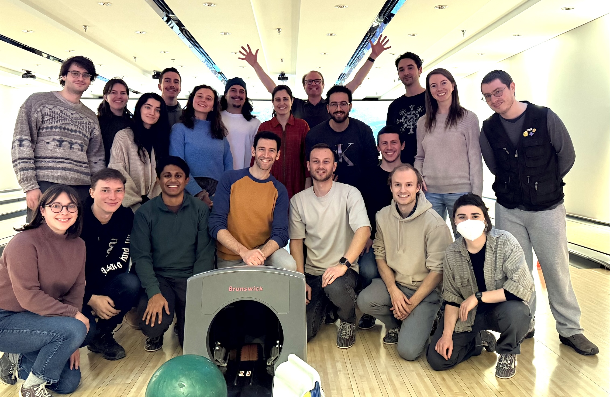

# 👫 Team

See [us on Github](https://github.com/orgs/neuropoly/people), or our more specific profiles below.

## Faculty

* [Eva Alonso Ortiz](faculty/eva-alonso-ortiz.md)
  [<i class="fa fa-envelope"></i>](mailto:eva.alonso-ortiz@polymtl.ca)
  [<i class="fab fa-linkedin"></i>](https://www.linkedin.com/in/eva-alonso-ortiz/)
  [<i class="fab fa-twitter"></i>](https://twitter.com/evaalonsoortiz)
  [<i class="fa-brands fa-bluesky"></i>](https://bsky.app/profile/evaalonsoortiz.bsky.social)
  [<i class="fab fa-github"></i>](https://github.com/evaalonsoortiz)
* [Julien Cohen-Adad](faculty/julien-cohen-adad.md)
  [<i class="fa fa-envelope"></i>](mailto:julien.cohen-adad@polymtl.ca)
  [<i class="fab fa-linkedin"></i>](https://www.linkedin.com/in/jcohenadad/)
  [<i class="fab fa-twitter"></i>](https://twitter.com/jcohenadad)
  [<i class="fa-brands fa-bluesky"></i>](https://bsky.app/profile/jcohenadad.bsky.social)
  [<i class="fab fa-github"></i>](https://github.com/jcohenadad/)
* [Benjamin De Leener](faculty/benjamin-de-leener.md)
  [<i class="fa fa-envelope"></i>](mailto:benjamin.de-leener@polymtl.ca)
  [<i class="fab fa-linkedin"></i>](https://www.linkedin.com/in/benjamindeleener/)
  [<i class="fab fa-twitter"></i>](https://twitter.com/bendeleener)
  [<i class="fa-brands fa-bluesky"></i>](https://bsky.app/profile/benjamindeleener.bsky.social)
  [<i class="fab fa-github"></i>](https://github.com/benjamindeleener)
* [Nikola Stikov](faculty/nikola-stikov.md)
  [<i class="fa fa-envelope"></i>](mailto:nikola.stikov@polymtl.ca)
  [<i class="fab fa-linkedin"></i>](https://www.linkedin.com/in/nikola-stikov-20a4a34/)
  [<i class="fab fa-twitter"></i>](https://twitter.com/stikov)
  [<i class="fa-brands fa-bluesky"></i>](https://bsky.app/profile/stikov.bsky.social)
  [<i class="fab fa-github"></i>](https://github.com/nstikov/)

## Research Associates

* [Mathieu Boudreau](research-associates/mathieu-boudreau.md)
  [<i class="fa fa-envelope"></i>](mailto:mathieu.boudreau@polymtl.ca)
  [<i class="fab fa-linkedin"></i>](https://ca.linkedin.com/in/mathieujboudreau)
  [<i class="fab fa-twitter"></i>](https://twitter.com/_mattboud)
  [<i class="fa-brands fa-bluesky"></i>](https://bsky.app/profile/mathieuboudreau.bsky.social)
  [<i class="fab fa-github"></i>](https://github.com/mathieuboudreau)
* Mathieu Guay-Paquet
  [<i class="fa fa-envelope"></i>](mailto:mathieu.guay-paquet@polymtl.ca)
  [<i class="fab fa-github"></i>](https://github.com/mguaypaq)
* [Nibardo Lopez Rios](research-associates/nibardo-lopez-rios.md)
* Emma Lichtenstein
  [<i class="fa fa-envelope"></i>](mailto:emma.lichtenstein@polymtl.ca)
  [<i class="fab fa-github"></i>](https://github.com/nullnik-0)
* Joshua Newton
  [<i class="fa fa-envelope"></i>](mailto:joshua.newton@polymtl.ca)
  [<i class="fab fa-linkedin"></i>](https://www.linkedin.com/in/joshuacwnewton/)
  [<i class="fab fa-github"></i>](https://github.com/joshuacwnewton)
* Jan Paška
* Kalum Ost
  [<i class="fa fa-envelope"></i>](mailto:kalum.ost@polymtl.ca)
  [<i class="fab fa-github"></i>](https://github.com/SomeoneInParticular)

## Postdoctoral Researchers

* [Jan Valosek](postdoctoral-researchers/jan-valosek.md)
  [<i class="fa fa-envelope"></i>](mailto:jan.valosek@polymtl.ca)
  [<i class="fab fa-linkedin"></i>](https://www.linkedin.com/in/jan-valosek)
  [<i class="fab fa-twitter"></i>](https://twitter.com/ValosekJan)
  [<i class="fab fa-github"></i>](https://github.com/valosekj)
* [Agah Karakuzu](phd-students/agah-karakuzu.md)

## PhD Students

* Alexandre D'Astous
  [<i class="fa fa-envelope"></i>](mailto:adastous023@gmail.com)
  [<i class="fab fa-github"></i>](https://github.com/po09i)
* Andjela Dimitrijevic
  [<i class="fa fa-envelope"></i>](mailto:andjela.dimitrijevic@polymtl.ca)
  [<i class="fab fa-linkedin"></i>](https://www.linkedin.com/in/andjela-dimitrijevic-470651171/)
  [<i class="fab fa-github"></i>](https://github.com/Andjelaaaa)
* Daniel Ridani
  [<i class="fa fa-envelope"></i>](mailto:daniel.ridani@polymtl.ca)
  [<i class="fab fa-github"></i>](https://github.com/Danirid)
* Nathan Molinier
  [<i class="fa fa-envelope"></i>](mailto:nathan.molinier@polymtl.ca)
  [<i class="fab fa-linkedin"></i>](https://www.linkedin.com/in/nathan-molinier-743972180/)
  [<i class="fab fa-github"></i>](https://github.com/NathanMolinier)
* Nilser Laines Medina
  [<i class="fa fa-envelope"></i>](mailto:nilser.laines@gmail.com)
  [<i class="fab fa-linkedin"></i>](https://www.linkedin.com/in/nilser-laines/)
  [<i class="fa-brands fa-bluesky"></i>](https://bsky.app/profile/nilserlaines.bsky.social)
  [<i class="fab fa-github"></i>](https://github.com/Nilser3)
* Samuelle St-Onge
  [<i class="fa fa-envelope"></i>](mailto:samuelle.st-onge@polymtl.ca)
  [<i class="fab fa-linkedin"></i>](https://www.linkedin.com/in/samuelle-st-onge-578b89185/)
  [<i class="fab fa-github"></i>](https://github.com/samuellestonge)
* [Pierre-Louis Benveniste ](https://plbenveniste.github.io/)
  [<i class="fa fa-envelope"></i>](mailto:pierrelouis.benveniste03@gmail.com)
  [<i class="fab fa-linkedin"></i>](https://www.linkedin.com/in/pierre-louis-benveniste/)
  [<i class="fab fa-github"></i>](https://github.com/plbenveniste)
* Sandrine Bédard
  [<i class="fab fa-linkedin"></i>](https://www.linkedin.com/in/sandrine-b%C3%A9dard-453939186/)
  [<i class="fab fa-twitter"></i>](https://twitter.com/SandBedard)
  [<i class="fa-brands fa-bluesky"></i>](https://bsky.app/profile/sandbedard.bsky.social)
  [<i class="fab fa-github"></i>](https://github.com/sandrinebedard)
* Armand Collin
  [<i class="fab fa-github"></i>](https://github.com/hermancollin)

## MSc Students

* Sebastian Rios
  [<i class="fab fa-linkedin"></i>](https://https://www.linkedin.com/in/sebastian-adolfo-488b08192/)
* Thomas Dagonneau
  [<i class="fab fa-linkedin"></i>](https://www.linkedin.com/in/thomas-dagonneau-83630a234/)
  [<i class="fab fa-twitter"></i>](https://x.com/ThomasDagonneau)
  [<i class="fab fa-github"></i>](https://github.com/tomDag25)
* Nolan Beaujault
  [<i class="fa fa-envelope"></i>](mailto:beaujaultnolan@gmail.com)
  [<i class="fab fa-linkedin"></i>](https://www.linkedin.com/in/nolan-beaujault/)
  [<i class="fab fa-github"></i>](https://github.com/NolanBeaujault)
* Youssef Laatar
  [<i class="fa fa-envelope"></i>](mailto:yousseflaatar@gmail.com)
  [<i class="fab fa-linkedin"></i>](https://www.linkedin.com/in/yolaatar/)
  [<i class="fab fa-github"></i>](https://github.com/yolaatar)

## Interns

* Julien Laborde-Peyré
  [<i class="fa fa-envelope"></i>](mailto:julien.lbrd@gmail.com)
  [<i class="fab fa-linkedin"></i>](https://www.linkedin.com/in/julien-laborde-peyre/)
  [<i class="fab fa-github"></i>](https://github.com/julaborde)
* Hugo Albert Plante
  [<i class="fa fa-envelope"></i>](mailto:hugo.albert-plante@etud.polymtl.ca)
  [<i class="fab fa-linkedin"></i>](https://www.linkedin.com/in/hugo-albert-plante-55a99b2b3)
  [<i class="fab fa-github"></i>](https://github.com/haplante)
* Murielle Mardenli
  [<i class="fa fa-envelope"></i>](mailto:murielle.mardenli@polymtl.ca)
  [<i class="fab fa-linkedin"></i>](https://www.linkedin.com/in/murielle-mardenli-7a0804238/)
  [<i class="fab fa-github"></i>](https://github.com/MurielleMardenli200)
* Edgar Kappauf
  [<i class="fa fa-envelope"></i>](mailto:edgar.kappauf@polymtl.ca)
  [<i class="fab fa-linkedin"></i>](https://www.linkedin.com/in/edgar-k-40a4641b6/)
  [<i class="fab fa-github"></i>](https://github.com/edgark31)
* Camille Lortie
  [<i class="fa fa-envelope"></i>](mailto:camille.lortie@polymtl.ca)
  [<i class="fab fa-github"></i>](https://github.com/camillelortie)
* Kuan Yi Wang
  [<i class="fa fa-envelope"></i>](mailto:kuanyi.wang0906@gmail.com)
  [<i class="fab fa-linkedin"></i>](https://www.linkedin.com/in/kuan-yi-wang-443871319/)
  [<i class="fab fa-github"></i>](https://github.com/AcastaPaloma)
* Artem Kovalchuk
  [<i class="fa fa-envelope"></i>](mailto:artem.sp28@@gmail.com)
  [<i class="fab fa-linkedin"></i>](https://www.linkedin.com/in/artem-kovalchuk-8678491b5/)
  [<i class="fab fa-github"></i>](https://github.com/artm00)
* Axelle Monnot
  [<i class="fa fa-envelope"></i>](mailto:axelle.monnot@etud.polymtl.ca)
  [<i class="fab fa-github"></i>](https://github.com/axelle-m)
* Nontharat Tucksinapinunchai
  [<i class="fa fa-envelope"></i>](mailto:nontharatt@gmail.com)
  [<i class="fab fa-linkedin"></i>](https://www.linkedin.com/in/nontharat-tucksinapinunchai-50a475365/)
  [<i class="fab fa-github"></i>](https://github.com/NTucksinapinunchai)

## Alumni

* Antoine Guénette
  [<i class="fa fa-envelope"></i>](mailto:antoine.guenette@polymtl.ca)
  [<i class="fab fa-linkedin"></i>](www.linkedin.com/in/antoine-guénette-569905260)
  [<i class="fab fa-github"></i>](https://github.com/AntoineGuenette)
* Abel Salmona
  [<i class="fa fa-envelope"></i>](mailto:abel.salmona@polymtl.ca)
  [<i class="fab fa-linkedin"></i>](https://www.linkedin.com/in/abel-salmona-a197b3189/)
  [<i class="fab fa-github"></i>](https://github.com/abelsalm)
* Erjun Zhang
  [<i class="fa fa-envelope"></i>](mailto:erjun.zhang@polymtl.ca)
  [<i class="fab fa-linkedin"></i>](https://www.linkedin.com/in/zhangerjun/)
  [<i class="fab fa-github"></i>](https://github.com/zhangerjun)
* [Naga Karthik](https://naga-karthik.github.io)
  [<i class="fa fa-envelope"></i>](mailto:emvnagakarthik@gmail.com)
  [<i class="fab fa-linkedin"></i>](https://www.linkedin.com/in/naga-karthik-enamundram-7b1559174/)
  [<i class="fab fa-twitter"></i>](https://twitter.com/naga_karthik7)
  [<i class="fab fa-github"></i>](https://github.com/naga-karthik)
* [Rohan Banerjee](https://rohanbanerjee.netlify.app)
  [<i class="fa fa-envelope"></i>](mailto:banerjee.rohan98@gmail.com)
  [<i class="fab fa-linkedin"></i>](https://www.linkedin.com/in/rohanbanerjee1)
  [<i class="fab fa-twitter"></i>](https://twitter.com/rohanbanerjeee)
  [<i class="fab fa-github"></i>](https://github.com/rohanbanerjee)
* Alexia Mahlig
* Maxime Bouthillier
  [<i class="fa fa-envelope"></i>](mailto:mbmsc2025@gmail.com)
  [<i class="fab fa-linkedin"></i>](https://www.linkedin.com/in/maxime-bouthilliermd)
  [<i class="fab fa-github"></i>](https://github.com/maxradx)
* Arthur Toulouse
  [<i class="fa fa-envelope"></i>](mailto:t.arthur1729@gmail.com)
  [<i class="fab fa-linkedin"></i>](https://www.linkedin.com/in/arthur-toulouse)
  [<i class="fab fa-github"></i>](https://github.com/arthurtoulouse)
* Arnaud Bréhéret
  [<i class="fab fa-linkedin"></i>](https://www.linkedin.com/in/arnaud-br%C3%A9h%C3%A9ret-8ba353232/)
  [<i class="fab fa-github"></i>](https://github.com/4rnaudB)
* Alexandre Babic
  [<i class="fab fa-linkedin"></i>](https://www.linkedin.com/in/alexandre-babic-b4419b328/)
  [<i class="fab fa-github"></i>](https://github.com/ababic12)
* Nathan Gorvett
  [<i class="fa fa-envelope"></i>](mailto:nathan@nzm.ca)
* Arthur Boschet
  [<i class="fa fa-envelope"></i>](mailto:arthur.boschet@mila.quebec)
  [<i class="fab fa-linkedin"></i>](https://www.linkedin.com/in/arthur-boschet/)
  [<i class="fab fa-github"></i>](https://github.com/ArthurBoschet)
* Baptiste Taverne
  [<i class="fa fa-envelope"></i>](mailto:baptiste.taverne@polytechnique.edu)
  [<i class="fab fa-linkedin"></i>](https://www.linkedin.com/in/baptiste-taverne-26739a254/)
  [<i class="fab fa-github"></i>](https://github.com/BreziTasbi)
* Simon Queric
  [<i class="fa fa-envelope"></i>](mailto:simon.queric@telecom-paris.fr)
  [<i class="fab fa-linkedin"></i>](https://www.linkedin.com/in/simon-queric-157b81225)
  [<i class="fab fa-github"></i>](https://github.com/simonqueric)
* Kateřina Krejčí
  [<i class="fa fa-envelope"></i>](mailto:xkrejc78@vutbr.cz)
  [<i class="fab fa-linkedin"></i>](https://www.linkedin.com/in/kate%C5%99ina-krej%C4%8D%C3%AD-0766062b6/)
  [<i class="fab fa-github"></i>](https://github.com/KaterinaKrejci231054)
* Charles Pageot
  [<i class="fa fa-envelope"></i>](mailto:charles.pageot@polymtl.ca)
  [<i class="fab fa-linkedin"></i>](https://ca.linkedin.com/in/charles-pageot-147b97262)
  [<i class="fab fa-github"></i>](https://github.com/CharlesPageot)
* Nishka Katoch
* Behrouz Vejdani Afkham
  [<i class="fa fa-envelope"></i>](mailto:behrouz.vejdani-afkham@polymtl.ca)
  [<i class="fab fa-linkedin"></i>](https://www.linkedin.com/in/behrouz-vejdani-afkham-864913141/)
  [<i class="fab fa-github"></i>](https://github.com/behrouzvia)
* Jeanne Malécot
  [<i class="fa fa-envelope"></i>](mailto:jeanne.malecot@telecom-paris.fr)
  [<i class="fab fa-linkedin"></i>](https://www.linkedin.com/in/jeannemalecot/)
  [<i class="fab fa-github"></i>](https://github.com/MalecotJeanne)
* Julien Thouveny
* Colline Blanc
  [<i class="fa fa-envelope"></i>](mailto:colline.blanc@polymtl.ca)
  [<i class="fab fa-linkedin"></i>](https://www.linkedin.com/in/collineblc/)
  [<i class="fab fa-github"></i>](https://github.com/CollineBlanc)
* Noée Ducros-Chabot
  [<i class="fa fa-envelope"></i>](mailto:noee.ducros-chabot@polymtl.ca)
  [<i class="fab fa-linkedin"></i>](https://www.linkedin.com/in/no%C3%A9e-ducros-chabot-1bb6a51a1/)
  [<i class="fab fa-github"></i>](https://github.com/noeedc)
* Antoine El Hachem
  [<i class="fa fa-envelope"></i>](mailto:antoine-2.el-hachem@polymtl.ca)
  [<i class="fab fa-linkedin"></i>](https://www.linkedin.com/in/antoineelhachem/)
* Sina Fartoumi
  [<i class="fa fa-envelope"></i>](mailto:sina.fartoumi@polymtl.ca)
* Camille Coustaury
  [<i class="fab fa-linkedin"></i>](https://www.linkedin.com/in/camille-coustaury/)
* Rachad Chazbek
* Theo Badra
* Pierre Lechat
* Daniel Papp
* Marie-Hélène Bourget
  [<i class="fab fa-github"></i>](https://github.com/mariehbourget)
* Nadia Blostein
  [<i class="fa fa-envelope"></i>](mailto:nadia.blostein@polymtl.ca)
  [<i class="fab fa-twitter"></i>](https://twitter.com/BlosteinNadia)
  [<i class="fab fa-github"></i>](https://github.com/nadiablostein)
* Yang Ding
* Nick Guenther
  [<i class="fa fa-envelope"></i>](mailto:nick.guenther@polymtl.ca)
  [<i class="fab fa-github"></i>](https://github.com/kousu)
* Aurélien Pujol
* Victor Baillet
  [<i class="fa fa-envelope"></i>](mailto:victor.baillet@polytechnique.edu)
  [<i class="fab fa-linkedin"></i>](https://www.linkedin.com/in/victor-baillet-a098a2202/)
  [<i class="fab fa-github"></i>](https://github.com/VictorBaillet)
* Etienne du Fayet
  [<i class="fa fa-envelope"></i>](mailto:etienne.du-fayet-de-la-tour@polytechnique.edu)
  [<i class="fab fa-linkedin"></i>](https://www.linkedin.com/in/etienne-d-610a9a134/)
  [<i class="fab fa-github"></i>](https://github.com/etdufay)
* Théo Mathieu
  [<i class="fa fa-envelope"></i>](mailto:theo.mathieu@insa-lyon.fr)
  [<i class="fab fa-linkedin"></i>](https://www.linkedin.com/in/theo-mathieu7/)
  [<i class="fab fa-github"></i>](https://github.com/tzebre)
* Adrian El Baz
  [<i class="fab fa-linkedin"></i>](https://www.linkedin.com/in/adrian-el-baz/)
  [<i class="fab fa-github"></i>](https://github.com/ebadrian)
* Louis-François Bouchard
  [<i class="fa fa-envelope"></i>](mailto:bouchard.lf@gmail.com)
  [<i class="fab fa-linkedin"></i>](https://www.linkedin.com/in/whats-ai/)
  [<i class="fab fa-twitter"></i>](https://twitter.com/Whats_AI)
  [<i class="fab fa-github"></i>](https://github.com/louisfb01)
* Michelle Chen
* Busra Bulut
  [<i class="fab fa-linkedin"></i>](https://www.linkedin.com/in/busra-bulut-a26420204/)
* Ismail Foudali 
  [<i class="fab fa-linkedin"></i>](https://www.linkedin.com/in/ismail-foudali-780728166/)
* Vicente Enguix
* Noel Rignon
  [<i class="fa fa-envelope"></i>](mailto:noel.rignon@fjnr.ca)
  [<i class="fab fa-linkedin"></i>](https://www.linkedin.com/in/rignonnoel/)
  [<i class="fab fa-github"></i>](https://github.com/RignonNoel/)
* Lore Flipts
  [<i class="fab fa-linkedin"></i>](https://www.linkedin.com/in/lore-flipts-251688234/)
* Konstantinos Nasiotis
* Theo Gnassounou
* Shu Ai Song
* Paul Bautin
  [<i class="fab fa-linkedin"></i>](https://www.linkedin.com/in/paul-bautin-757690175/)
* Evan Beal
* [Taowa Rosetwig](research-associates/taowa-rosetwig.md)
* David Arsenault-Belley
* Justin De Meulemeester
* Mathilde Dupouy
* Julia Palaretti
* Louis Joseph Laberge
  [<i class="fab fa-linkedin"></i>](https://www.linkedin.com/in/louis-joseph-laberge-8452b4207/)
* Ambroise Odonnat
* Gaspard Cereza
  [<i class="fa fa-envelope"></i>](mailto:gaspard.cereza@gmail.com)
  [<i class="fab fa-linkedin"></i>](https://www.linkedin.com/in/gaspard-cereza-495584144/)
  [<i class="fab fa-github"></i>](https://github.com/gaspardcereza)
* Andréanne Lemay
  [<i class="fa fa-envelope"></i>](mailto:andreanne.lemay@polymtl.ca)
  [<i class="fab fa-linkedin"></i>](https://www.linkedin.com/in/andreanne-lemay/)
  [<i class="fab fa-github"></i>](https://github.com/andreanne-lemay)
* Alexandru Foias
  [<i class="fab fa-linkedin"></i>](https://ca.linkedin.com/in/alexandrufoias)
* [Ryan Topfer](phd-students/ryan-topfer.md)
* Atef Badji
* Srishti Yadav
* [Gabriel Mangeat](alumni/gabriel-mangeat.md)
* Benjamin Carrier
* Alexandre Bernard
* Noémie Roberge
* Ainsleigh Hill
  [<i class="fab fa-linkedin"></i>](https://www.linkedin.com/in/ainsleigh-hill-836296124/)
* Olivier Vincent
* Maylis Heussner
* [Jennifer Campbell](http://www.bic.mni.mcgill.ca/~jcampbel/)
* [Ilana Leppert](http://www.bic.mni.mcgill.ca/PeopleStaff/LeppertIlana)
* [Tommy Boshkovski](alumni/tommy-boshkovski.md)
* Lucas Rouhier
  [<i class="fab fa-github"></i>](https://github.com/lrouhier)
* Leander van Eekelen
  [<i class="fab fa-linkedin"></i>](https://www.linkedin.com/in/leander-van-eekelen/)
* Anne Kerbrat
* Sara Paperi
* Anthime Bucquet
* [Harris Nami](alumni/harris-nami.md)
* Thiago Junqueira
* Valentine Louis-Lucas
* Benoit Sauty-De-Chalon
* Aurelien Gilliot
* Hee-Min Yang
* Vasudev Sharma
  [<i class="fab fa-linkedin"></i>](https://in.linkedin.com/in/vs74)
* Alexa Mousley
* Nicolas Pinon
* [Christian S. Perone](alumni/christian-s.-perone.md)
* Melanie Lubrano
* Hadi Hammoud
* Oumayma Bounou
* François Paugam
* Axel Guittonneau
* Matthieu Parizet
* Stephanie Alley
* Hadi Begdouri
* Angel Paul Chauffray
* Pierre-Olivier Quirion
* George Peristerakis
* Haykel Snoussi
* [Aldo Zaimi](alumni/aldo-zaimi.md)
* Ariane Saliani
* Dominique Eden
* Maxime Wabartha
* Darya Morozov
* Pascale Beliveau
* Manh-Tung Vuong
* Alexandros Popov
* Pierre-Louis Antonsanti
* Sara Dupont
* Grégoire Germain
* Simon Lévy
* Camille Van-Assel
* Alexandre Daigle-Martel
* Willis Pinaud
* Tom Mingasson
* Victor Herman
* Olivier Comtois
* Jean François Pelletier Paquette
* Nadir Faci
* Jean-François Cabana
* Blanche Perraud
* William Perrault
* Tanguy Magnan
* [Tanguy Duval](alumni/tanguy-duval.md)
* Paul Picard
* Ritesh Warty
* Thomas Sharif-Kerdreux
* Nicola Paolantonio
* Augustin Roux
* Julien Touati
* Charles Naaman
* Mathieu Flamand
* Olivier Barron
* Konstantinos Papoutsis
* Karun Raju
* Isabelle Bouchard
* Eddie Magnide
* William Thong
* Geoffrey Levêque
* Marc Benhamou
* Felipe Reis
* Eugénie Ullmann
* Zaki Ajabi
* Tanya Verma
* Lamiaa Amzil
* Genevieve Foley
* Jennifer Khoury
* Alexandre Brunet
* Atma-Luseck Adoungotchodo
* Elisabeth Chevalier
* Marius Tuznick
* Laura Brightman
* Aamer Ar
* Aram Sevag
* Kiri Stern
  [<i class="fa fa-envelope"></i>](mailto:kiri.stern@mail.mcgill.ca)
  [<i class="fab fa-linkedin"></i>](https://www.linkedin.com/in/kiri-stern-6a7199197/)
  [<i class="fab fa-twitter"></i>](https://twitter.com/_kastern)
  [<i class="fab fa-github"></i>](https://github.com/kiristern)
* [Uzay Macar](https://uzaymacar.github.io)
  [<i class="fa fa-envelope"></i>](mailto:uzay.macar@gmail.com)
  [<i class="fab fa-github"></i>](https://github.com/uzaymacar)

